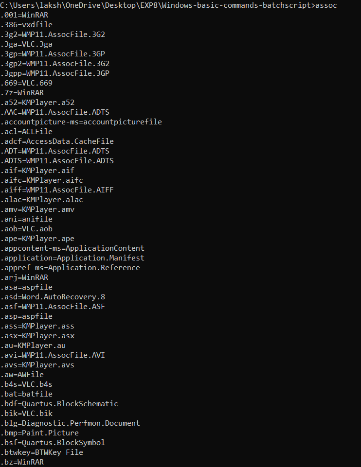
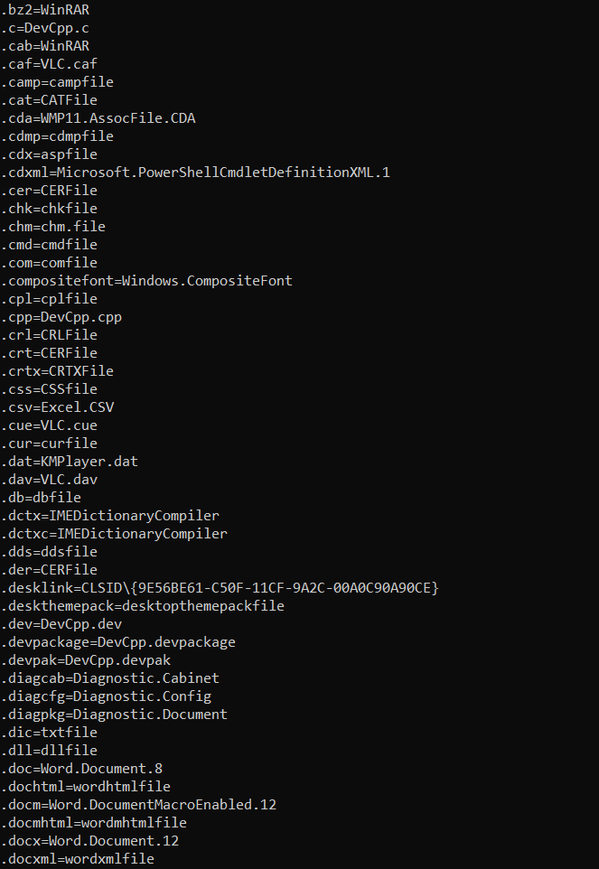
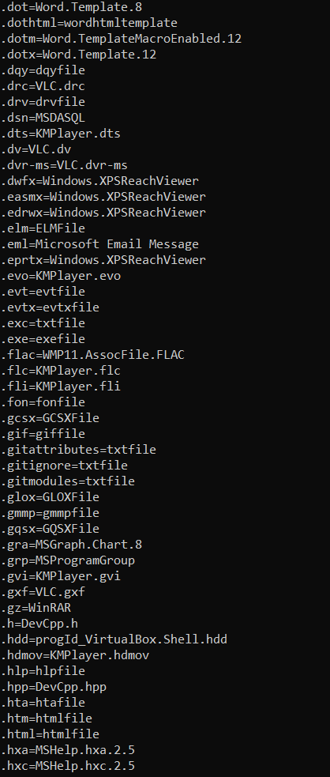
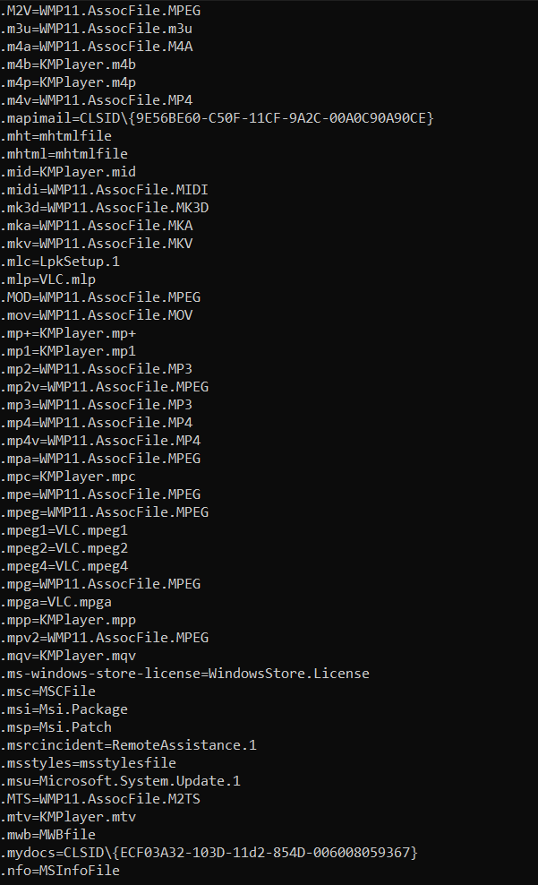
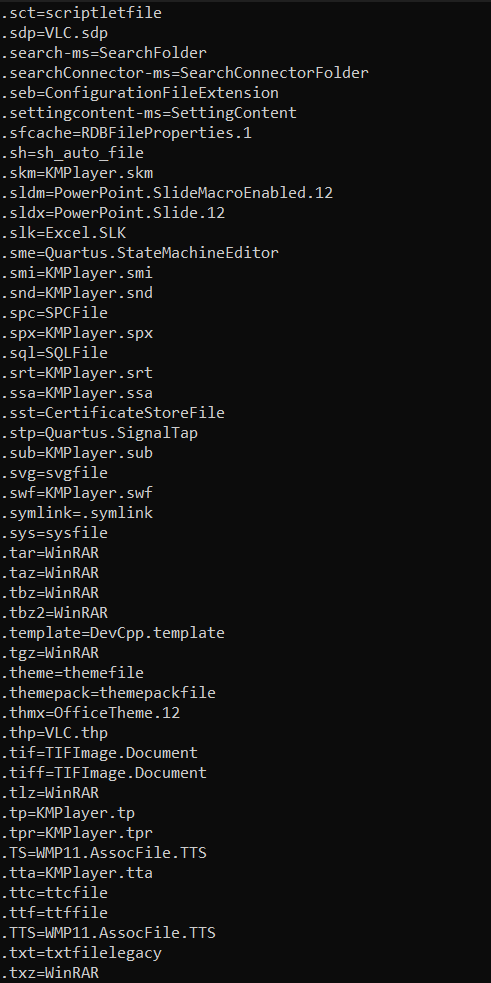
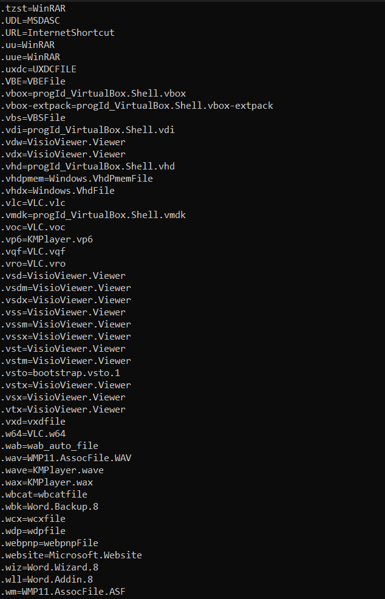
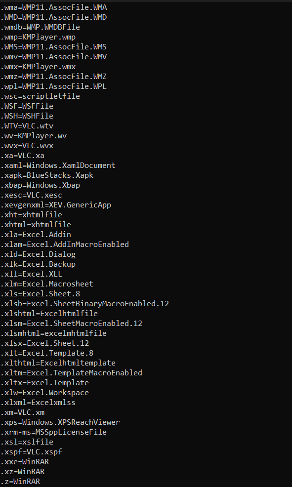
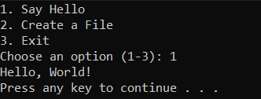
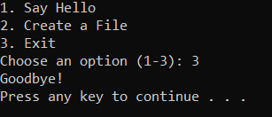

# Windows-basic-commands-batchscript
Ex08-Windows-basic-commands-batchscript

# AIM:
To execute Windows basic commands and batch scripting

# DESIGN STEPS:

### Step 1:

Navigate to any Windows environment installed on the system or installed inside a virtual environment like virtual box/vmware 

### Step 2:

Write the Windows commands / batch file . Save each script in a file with a .bat extension. Ensure you have the necessary permissions to perform the operations. Adapt paths as needed based on your system configuration.
### Step 3:

Execute the necessary commands/batch file for the desired output. 


# WINDOWS COMMANDS:
## Exercise 1: Basic Directory and File Operations

---
## Create a directory named "my-folder"

 __COMMAND AND OUTPUT__


## Remove the directory "my-folder"

**COMMAND AND OUTPUT**


## Create the file Rose.txt

**COMMAND AND OUTPUT**


## Create the file hello.txt using echo and redirection

 __COMMAND AND OUTPUT__


## Copy the file hello.txt into the file hello1.txt

__COMMAND AND OUTPUT__


## Remove the file hello1.txt

 __COMMAND AND OUTPUT__


## List out the file hello1.txt in the current directory

 __COMMAND AND OUTPUT__


## List out all the associated file extensions 

__COMMAND AND OUTPUT__











## Compare the file hello.txt and rose.txt

 __COMMAND AND OUTPUT__


## Exercise 2: Advanced Batch Scripting
__1__.Create a batch file named on the desktop. The batch file need to have a variable assigned with a desired name for ex. name="John" and display as "Hello, John".

### BATCH PROGRAM

``` batch
@echo off
set name=John
echo Hello, %name%
pause
```


### OUTPUT


__2__.Create a batch file  on the desktop that checks whether a user-input number is odd or not. The script should:
Prompt the user to enter a number.
Calculate the remainder when the number is divided by 2.
Display whether the number is odd or not.
Ask the user if they want to check another number.
Repeat the process if the user enters Y, and exit with a thank-you message if the user enters N.
Handle invalid inputs for the continuation prompt (Y/N) gracefully.

### BATCH PROGRAM
``` batch
@echo off
:loop
set /p num=Enter a number: 
set /a rem=%num% %% 2

if %rem%==0 (
    echo %num% is Even
) else (
    echo %num% is Odd
)

:ask
set /p ans=Do you want to check another number? (Y/N): 
if /I "%ans%"=="Y" goto loop
if /I "%ans%"=="N" goto end
echo Invalid input. Please enter Y or N.
goto ask

:end
echo Thank you!
pause
```

### OUTPUT


__3__.Write a batch file that uses a FOR loop to iterate over a sequence of numbers (1 to 5) and displays each number with the label Number:. The output should pause at the end.

### BATCH PROGRAM

``` batch
@echo off
for /L %%i in (1,1,5) do (
    echo Number: %%i
)
pause
```

### OUTPUT


__4__.Write a batch script to check whether a file named sample.txt exists in the current directory. If the file exists, display the message sample.txt exists. Otherwise, display sample.txt does not exist. Pause the script at the end to view the result.

__Instructions:__
Use the IF EXIST conditional statement.
Make sure the script works for files located in the same directory as the batch file.
Use pause to keep the command window open after displaying the message.
Expected Output (if the file exists):

### BATCH PROGRAM

``` batch
@echo off
if exist sample.txt (
    echo sample.txt exists.
) else (
    echo sample.txt does not exist.
)
pause
```

### OUTPUT


__5__.Write a batch script that displays a simple menu with three options:
Say Hello – Displays the message Hello, World!
Create a File – Creates a file named newfile.txt with the content This is a new file
Exit – Exits the script with a goodbye message
The script should repeatedly display the menu until the user chooses to exit. Use goto statements to handle menu navigation.

### BATCH PROGRAM

``` batch
@echo off
:menu
cls
echo 1. Say Hello
echo 2. Create a File
echo 3. Exit
set /p choice=Choose an option (1-3): 

if "%choice%"=="1" goto hello
if "%choice%"=="2" goto create
if "%choice%"=="3" goto exit
echo Invalid choice.
pause
goto menu

:hello
echo Hello, World!
pause
goto menu

:create
echo This is a new file > newfile.txt
echo File newfile.txt created.
pause
goto menu

:exit
echo Goodbye!
pause
exit
```

### OUTPUT






# RESULT:
The commands/batch files are executed successfully.
